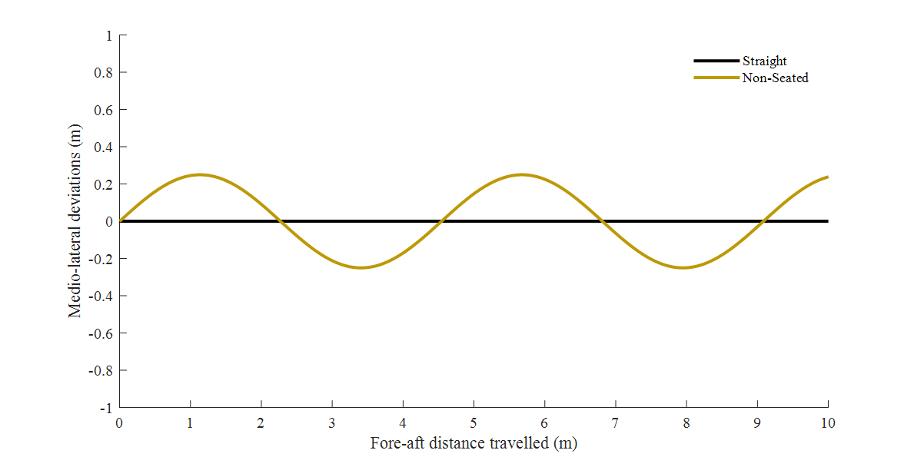

# cycle-path

MATLAB functions to estimate increase in bicycle path length due to lateral bicycle sway



| Author(s) | Brief Description | Intended Uses and Known Limitations | Included Material | Updated |
|-|-|-|-|-|
| Ross Wilkinson, Ph.D. | Uses numerical integration within MATLAB to calculate the increase in the path length travelled by a bicycle due to lean angle. | Investigate the effect of bicycle lean angle on the travel path of a bicycle at specific combinations of ground velocity and cadence. Assumes a sinusoidal travel path with an amplitude proportional to bicycle lean angle. |  MATLAB function | April 19, 2021 |

## Description

```matlab
function [pd, L, v, dT] = analyzeCyclePath(c1,c2,c3,cad,A,D)
    %ANALYZECYCLEPATH Analyze effect of bicycle lean on travel path
    %distance by integrating sine wave function with respect to 
    %distance covered.
    %   Inputs:
    %       c1  - Tyre circumference (m)
    %       c2  - Front-chainring circumference (teeth)
    %       c3  - Rear-sprocket circumference (teeth)
    %       cad - Cadence (rpm)
    %       A   - Amplitude of path due to lean (m)
    %       D   - Straight-line distance from point A to B (m)
    %   Outputs:
    %       pd  - Percentage diff. between new path length and D
    %       L   - New path length (m)
    %       v   - Velocity travelled (m/s)
    %       dT  - Time penalty compared to D (s)
    
    % calculate gain and wave length
    gain = c2/c3;
    lambda = c1*gain;
    
    % calculate period with respect to distance along x-axis
    k = 2*pi/lambda;
    
    % solve sine-wave function to find new path length
    syms x
    L = vpaintegral((A.^2*k.^2*cos(k.*x).^2 + 1)^(1/2),x,0,D);
    
    % calculate increase in path length, ground velocity, and time
    pd = (L/D - 1)*100;    
    v = lambda/(60/cad);
    dT = (L-D)/v;
    
end
```
